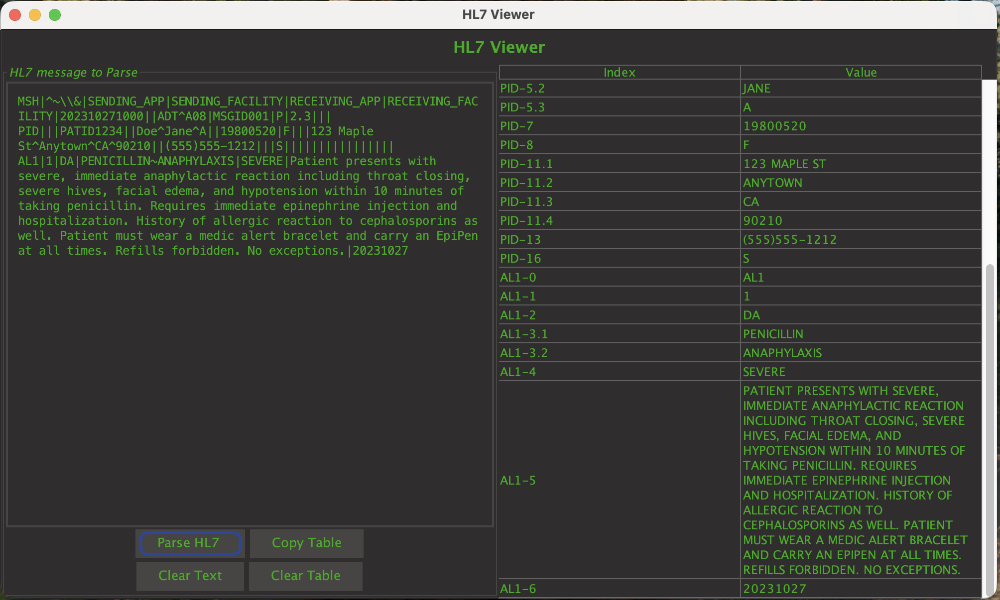

# HL7 Viewer
A Java-based HL7 message parser designed to efficiently parse and display its text and index in a table format.

## Overview

HL7 Viewer lets you parse and inspect HL7 messages in a structured table format. It supports field, repetition, component, and subcomponent breakdown.
The program is written in Java (ver. 24) and uses the Java Swing for the GUI.



## Features

- Parse HL7 messages and display each segment/field/component
- Copy table contents to clipboard
- Clear input and output
- Auto-resizing table with wrapped text
- Keyboard shortcut: **Ctrl+Enter** (_Windows and Mac_)  to parse message

## Requirements

- Java 24+
- Maven 3.9
- Java IDE

## Installation
1. Clone the repo  
    ```bash
        git clone https://github.com/steven-llamas/hl7-message-parser.git
    ```
2. Build with Maven, (_will install artifact into local maven repository_)
    ```bash
        mvn clean install
    ``` 
    1. Additionally, you can also Run the app without building
    ```bash
        mvn exec:java -Dexec.mainClass="hl7Viewer.Main"
    ```


This is useful for developers who want to modify the project or rebuild it.

---

###  Pre-built Installers (DMG / EXE)

### macOS
- Download the latest `.dmg` from [Releases](https://github.com/steven-llamas/hl7-message-parser/releases)
- Open the `.dmg` and drag **HL7 Viewer.app** to your Applications folder.

### Windows
- Download the `.exe` from [Releases](https://github.com/steven-llamas/hl7-message-parser/releases)
- Run the installer and follow the setup wizard.
